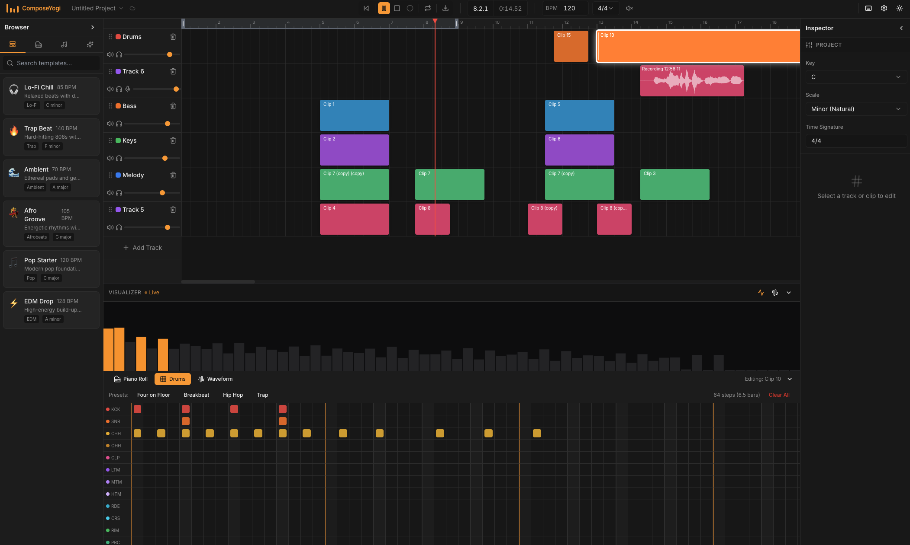

<div align="center">

# ComposeYogi


### Make real music. Instantly. In your browser.

A professional browser-based Digital Audio Workstation (DAW) with an Ableton-like interface.

[](https://github.com/AppsYogi-com/ComposeYogi)
[](https://hub.docker.com/r/appsyogi/composeyogi)
[](https://opensource.org/licenses/MIT)
[](https://patreon.com/SuperZero11)
[](https://github.com/sponsors/AppsYogi-com)

[Live Demo](https://composeyogi.com) · [Report Bug](https://github.com/AppsYogi-com/ComposeYogi/issues) · [Request Feature](https://github.com/AppsYogi-com/ComposeYogi/issues)

</div>

---

## ✨ Features

- 🎹 **Multi-track Timeline** — Audio, MIDI, and Drum tracks with drag-and-drop clips
- 🎼 **Piano Roll Editor** — Full-featured MIDI note editor with scale lock
- 🥁 **Drum Sequencer** — Step sequencer with pattern presets (Four on Floor, Hip Hop, Trap, etc.)
- 🎸 **Built-in Instruments** — Synths, bass, keys, leads, and pads powered by Tone.js
- 📊 **Real-time Visualizer** — Frequency bars and waveform display
- 🎚️ **Mixer Controls** — Volume, pan, mute, and solo per track
- ⏺️ **Audio Recording** — Record directly from your microphone with latency calibration
- 💾 **Local-first Storage** — Auto-save to IndexedDB, works offline
- 🎵 **MIDI Export** — Export your compositions to MIDI files
- ⌨️ **Keyboard Shortcuts** — Professional workflow with hotkeys
- 🌙 **Dark/Light Theme** — Easy on the eyes
- 🌍 **Internationalization** — English and Spanish supported

## 🖼️ Screenshots

<div align="center">

</div>

## 🚀 Quick Start

### Prerequisites

- **Node.js** 18.17 or later
- **npm**, **yarn**, or **pnpm**

### Installation

```bash
# Clone the repository
git clone git@github.com:AppsYogi-com/ComposeYogi.git
cd ComposeYogi

# Install dependencies
npm install

# Start development server
npm run dev
```

Open [http://localhost:3000](http://localhost:3000) in your browser.

### Production Build

```bash
npm run build
npm start
```

## 🐳 Docker

### Using Docker Compose (Recommended)

```bash
# Clone the repository
git clone git@github.com:AppsYogi-com/ComposeYogi.git
cd ComposeYogi

# Start with Docker Compose
docker-compose up -d

# Access at http://localhost:3000
```

### Using Docker directly

```bash
# Build the image
docker build -t composeyogi .

# Run the container
docker run -p 3000:3000 composeyogi
```

### Pull from Docker Hub

```bash
docker pull appsyogi/composeyogi:latest
docker run -p 3000:3000 appsyogi/composeyogi:latest
```

## 🛠️ Tech Stack

| Category | Technology |
|----------|------------|
| **Framework** | [Next.js 15](https://nextjs.org/) with App Router |
| **Language** | [TypeScript](https://www.typescriptlang.org/) |
| **Audio Engine** | [Tone.js](https://tonejs.github.io/) |
| **State Management** | [Zustand](https://zustand-demo.pmnd.rs/) + [Zundo](https://github.com/charkour/zundo) |
| **Styling** | [Tailwind CSS](https://tailwindcss.com/) |
| **UI Components** | [Radix UI](https://www.radix-ui.com/) |
| **Drag & Drop** | [@dnd-kit](https://dndkit.com/) |
| **Persistence** | [IndexedDB](https://developer.mozilla.org/en-US/docs/Web/API/IndexedDB_API) via [idb](https://github.com/jakearchibald/idb) |
| **i18n** | [next-intl](https://next-intl-docs.vercel.app/) |

## 📁 Project Structure

```
composeyogi.com/
├── app/                    # Next.js App Router
│   └── [locale]/           # i18n routing
│       ├── compose/        # Main DAW page
│       └── page.tsx        # Landing page
├── components/
│   ├── compose/            # DAW components
│   │   ├── editors/        # Clip editors (DrumSequencer, PianoRoll, WaveformEditor)
│   │   ├── AudioVisualizer.tsx
│   │   ├── BrowserPanel.tsx
│   │   ├── EditorPanel.tsx
│   │   ├── Inspector.tsx
│   │   ├── TrackList.tsx
│   │   └── Transport.tsx
│   └── ui/                 # Reusable UI primitives
├── lib/
│   ├── audio/              # Tone.js wrappers, recording, export
│   ├── store/              # Zustand stores
│   ├── persistence/        # IndexedDB operations
│   └── canvas/             # Canvas renderers
├── hooks/                  # Custom React hooks
├── types/                  # TypeScript definitions
└── messages/               # i18n translation files
```

## ⌨️ Keyboard Shortcuts

| Action | Shortcut |
|--------|----------|
| Play/Pause | `Space` |
| Stop (Return to start) | `Enter` |
| Toggle Record | `R` |
| Toggle Metronome | `M` |
| Toggle Loop | `L` |
| Undo | `Cmd/Ctrl + Z` |
| Redo | `Cmd/Ctrl + Shift + Z` |
| Duplicate Clip | `Cmd/Ctrl + D` |
| Delete Selection | `Delete` / `Backspace` |
| Toggle Browser | `B` |
| Toggle Editor | `E` |
| Toggle Inspector | `I` |
| Toggle Visualizer | `V` |
| Zoom In | `+` / `=` |
| Zoom Out | `-` |

## 🗺️ Development Roadmap

### ✅ Phase 1.0 — MVP (Complete)

- [x] Core DAW with multi-track timeline
- [x] Audio engine with Tone.js (play, stop, seek, loop)
- [x] MIDI and Drum clip editors
- [x] Recording with latency calibration
- [x] IndexedDB persistence with auto-save
- [x] MIDI export
- [x] Keyboard shortcuts
- [x] Dark/Light theme
- [x] i18n (English, Spanish)

### 🚧 Phase 1.5 — Cloud Sync (Planned)

- [ ] User authentication (Firebase/supabase)
- [ ] Cloud project sync
- [ ] Share links for projects
- [ ] WAV export
- [ ] Additional templates

### 🔮 Phase 2.0 — Pro Features (Future)

- [ ] Multi-take recording with comping
- [ ] Automation lanes
- [ ] Collaboration features
- [ ] Remix/fork system
- [ ] Time-stamped comments

## 🤝 Contributing

Contributions are welcome! Please read our [Contributing Guide](CONTRIBUTING.md) and [Code of Conduct](CODE_OF_CONDUCT.md) before submitting a Pull Request.

### Development Commands

```bash
npm run dev          # Start dev server with Turbopack
npm run build        # Production build
npm run start        # Start production server
npm run lint         # Run ESLint
npm run type-check   # TypeScript type checking
```

## 📄 License

This project is licensed under the MIT License - see the [LICENSE](LICENSE) file for details.

## 💖 Support

If you find ComposeYogi useful, please consider:

- ⭐ Starring the repository
- 🐛 Reporting bugs or requesting features
- 💰 [Sponsoring on GitHub](https://github.com/sponsors/AppsYogi-com)
- 🧡 [Supporting on Patreon](https://patreon.com/SuperZero11)

## 🙏 Acknowledgments

- [Tone.js](https://tonejs.github.io/) for the amazing Web Audio framework
- [Radix UI](https://www.radix-ui.com/) for accessible UI primitives
- [Vercel](https://vercel.com/) for hosting
- The open source community 💜

---

<div align="center">

Made with ❤️ by [AppsYogi](https://appsyogi.com)

</div>
