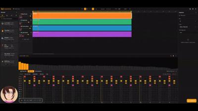
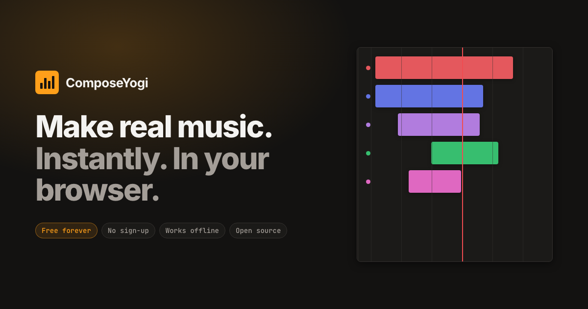

<div align="center">

# ComposeYogi


### The open-source Ableton-style music composer for the web.

A free, open-source music composition tool for beat-making, loops, and arrangements — built with Web Audio, WASM, and modern web tech.


[](https://github.com/AppsYogi-com/ComposeYogi)
[](https://hub.docker.com/r/appsyogi/composeyogi)
[](https://opensource.org/licenses/MIT)
[](https://patreon.com/SuperZero11)


[](https://discord.gg/M5qBX4Fz)

[Live Demo](https://composeyogi.com) · [Report Bug](https://github.com/AppsYogi-com/ComposeYogi/issues) · [Request Feature](https://github.com/AppsYogi-com/ComposeYogi/issues)

</div>

<div align="center">


</div>

---

## Why ComposeYogi?

| ComposeYogi | Traditional DAWs |
|------------|------------------|
| Open source | Closed source |
| Runs in browser | Heavy desktop installs |
| Free forever | Paid subscriptions |
| Community-driven | Vendor-controlled |
| Hackable & extensible | Locked ecosystems |

---

## Features

- 🎹 **Multi-track Timeline** — Audio, MIDI, and Drum tracks with drag-and-drop clips
- 🎼 **Piano Roll Editor** — Full-featured MIDI note editor with scale lock
- 🥁 **Drum Sequencer** — Step sequencer with pattern presets (Four on Floor, Hip Hop, Trap, etc.)
- 🎸 **64 Built-in Instruments** — Synths, bass, keys, leads, pads, drum kits, strings, wind and idiophones, powered by Tone.js
- 📊 **Real-time Visualizer** — Frequency bars and waveform display
- 🎚️ **Mixer Controls** — Volume, pan, mute, and solo per track
- ⏺️ **Audio Recording** — Record directly from your microphone with latency calibration
- 💾 **Local-first Storage** — Auto-save to IndexedDB, installable, works fully offline
- 🎵 **Export Anywhere** — WAV, MP3, MIDI, or a portable JSON project file
- ⌨️ **Keyboard Shortcuts** — Professional workflow with hotkeys
- 🌙 **Dark/Light Theme** — Easy on the eyes
- 🌍 **Internationalization** — English and Spanish supported

## Screenshots

<div align="center">

</div>

## One-Click Deploy

[](https://vercel.com/new/clone?repository-url=https://github.com/AppsYogi-com/ComposeYogi)
[](https://app.netlify.com/start/deploy?repository=https://github.com/AppsYogi-com/ComposeYogi)
[](https://railway.app/template?template=https://github.com/AppsYogi-com/ComposeYogi)
[](https://render.com/deploy?repo=https://github.com/AppsYogi-com/ComposeYogi)

## Quick Start

### Prerequisites

- **Node.js** 18.17 or later
- **npm**, **yarn**, or **pnpm**

### Installation

```bash
# Clone the repository
git clone git@github.com:AppsYogi-com/ComposeYogi.git
cd ComposeYogi

# Install dependencies
npm install

# Start development server
npm run dev
```

Open [http://localhost:3000](http://localhost:3000) in your browser.

### Production Build

```bash
npm run build
npm start
```

## Docker

### Using Docker Compose (Recommended)

```bash
# Clone the repository
git clone git@github.com:AppsYogi-com/ComposeYogi.git
cd ComposeYogi

# Start with Docker Compose
docker-compose up -d

# Access at http://localhost:3000
```

### Using Docker directly

```bash
# Build the image
docker build -t composeyogi .

# Run the container
docker run -p 3000:3000 composeyogi
```

### Pull from Docker Hub

```bash
docker pull appsyogi/composeyogi:latest
docker run -p 3000:3000 appsyogi/composeyogi:latest
```

## Tech Stack

| Category | Technology |
|----------|------------|
| **Framework** | [Next.js 15](https://nextjs.org/) with App Router |
| **Language** | [TypeScript](https://www.typescriptlang.org/) |
| **Audio Engine** | [Tone.js](https://tonejs.github.io/) |
| **State Management** | [Zustand](https://zustand-demo.pmnd.rs/) + [Zundo](https://github.com/charkour/zundo) |
| **Styling** | [Tailwind CSS](https://tailwindcss.com/) |
| **UI Components** | [Radix UI](https://www.radix-ui.com/) |
| **Drag & Drop** | [@dnd-kit](https://dndkit.com/) |
| **Persistence** | [IndexedDB](https://developer.mozilla.org/en-US/docs/Web/API/IndexedDB_API) via [idb](https://github.com/jakearchibald/idb) |
| **i18n** | [next-intl](https://next-intl-docs.vercel.app/) |

## Project Structure

```
composeyogi.com/
├── app/                    # Next.js App Router
│   └── [locale]/           # i18n routing
│       ├── compose/        # Main DAW page
│       └── page.tsx        # Landing page
├── components/
│   ├── compose/            # DAW components
│   │   ├── editors/        # Clip editors (DrumSequencer, PianoRoll, WaveformEditor)
│   │   ├── AudioVisualizer.tsx
│   │   ├── BrowserPanel.tsx
│   │   ├── EditorPanel.tsx
│   │   ├── Inspector.tsx
│   │   ├── TrackList.tsx
│   │   └── Transport.tsx
│   └── ui/                 # Reusable UI primitives
├── lib/
│   ├── audio/              # Tone.js wrappers, recording, export
│   ├── store/              # Zustand stores
│   ├── persistence/        # IndexedDB operations
│   ├── canvas/             # Canvas renderers
│   └── design/             # Design tokens — the source of every colour
├── design/                 # The design system: rules, artboards, previews
├── hooks/                  # Custom React hooks
├── types/                  # TypeScript definitions
├── tests/                  # Vitest suites
└── messages/               # i18n translation files
```

**[ARCHITECTURE.md](ARCHITECTURE.md)** goes deeper: how scheduling, state and
persistence actually work, and which invariants a change must not break.

## Keyboard Shortcuts

Press <kbd>/</kbd> in the studio for the full, always-current list — it renders
from the shortcut registry in `lib/shortcuts/`, and every shortcut is rebindable
from that same panel.

The ones worth knowing before you open it:

| Action | Shortcut |
|--------|----------|
| Play / Pause | <kbd>Space</kbd> |
| Stop (return to start) | <kbd>Enter</kbd> |
| Record | <kbd>R</kbd> |
| Loop | <kbd>L</kbd> |
| Undo / Redo | <kbd>Cmd/Ctrl</kbd> + <kbd>Z</kbd> / <kbd>Shift</kbd> + <kbd>Z</kbd> |
| Shortcut reference | <kbd>/</kbd> |

## Roadmap

**[ROADMAP.md](ROADMAP.md)** is the single source of truth for what has shipped
and what is coming next. It is kept in step with every release, so this README
does not repeat it.

Shipped so far: a full multi-track studio with recording and latency
calibration, 64 instruments, piano roll and drum sequencer, MIDI/WAV/MP3/JSON
export, offline PWA support, and local-first persistence with autosave.

## Contributing

Contributions are welcome! Please read our [Contributing Guide](CONTRIBUTING.md) and [Code of Conduct](CODE_OF_CONDUCT.md) before submitting a Pull Request.

### Development Commands

```bash
npm run dev          # Start dev server with Turbopack
npm run build        # Production build
npm run start        # Start production server
npm test             # Run the test suite (Vitest)
npm run check        # Locales + types + lint + tests — what CI runs
```

New to the codebase? **[ARCHITECTURE.md](ARCHITECTURE.md)** explains how the
audio engine, state and persistence fit together, and where the sharp edges are.
Issues labelled [`good first issue`](https://github.com/AppsYogi-com/ComposeYogi/labels/good%20first%20issue)
are scoped to be picked up without reading the whole thing first.

Building anything visual? **[design/](design/README.md)** is the design system —
tokens, usage rules and artboards. Every colour, radius and duration in the
product comes from one source, and `npm run check` fails if a component invents
its own. Read it before you start; it will save you a review round.

## License

This project is licensed under the MIT License - see the [LICENSE](LICENSE) file for details.

## Open Source First

ComposeYogi is built on the belief that creative tools should be:
- Open and inspectable
- Free from lock-in
- Community-driven
- Accessible to everyone

We welcome contributors, musicians, designers, and developers.

## Support

If you find ComposeYogi useful, please consider:

- Starring the repository
- Reporting bugs or requesting features
- [Sponsoring on GitHub](https://github.com/sponsors/AppsYogi-com)
- [Supporting on Patreon](https://patreon.com/SuperZero11)

## Acknowledgments

- [Tone.js](https://tonejs.github.io/) for the amazing Web Audio framework
- [Radix UI](https://www.radix-ui.com/) for accessible UI primitives
- [Vercel](https://vercel.com/) for hosting
- The open source community 💜

---

<div align="center">

Made with ❤️ by [AppsYogi](https://appsyogi.com)

</div>
